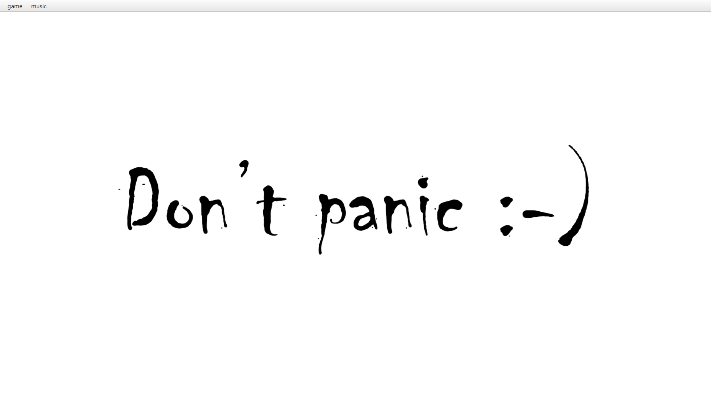
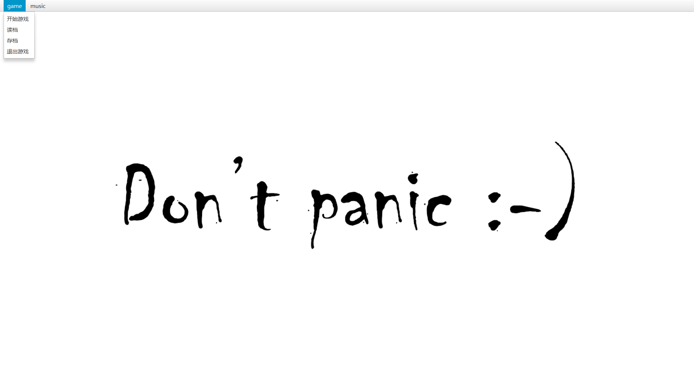
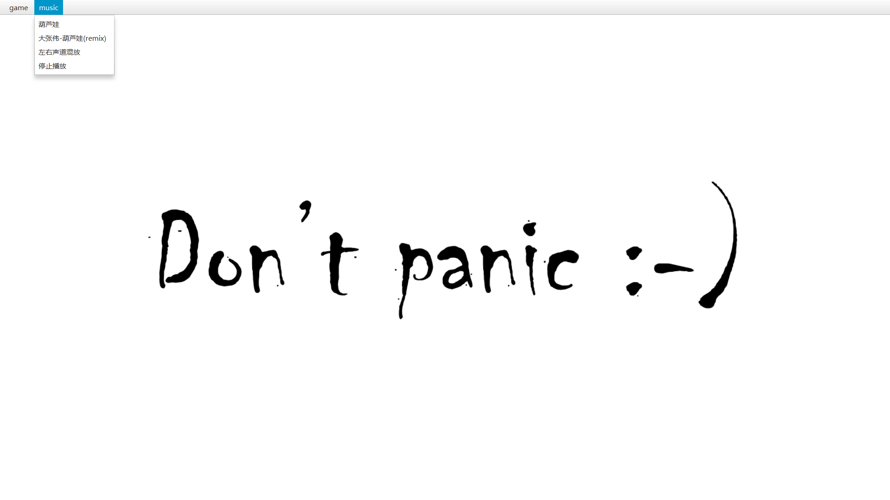
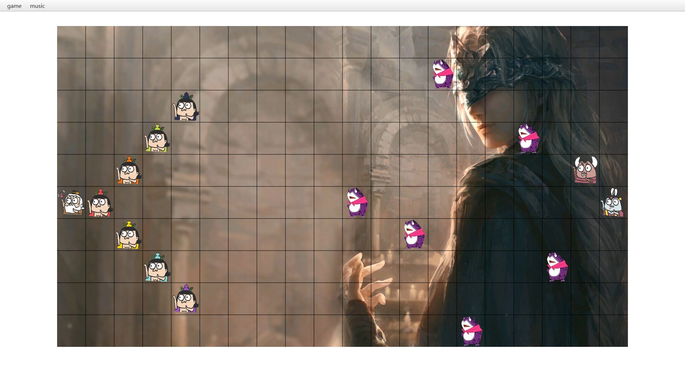
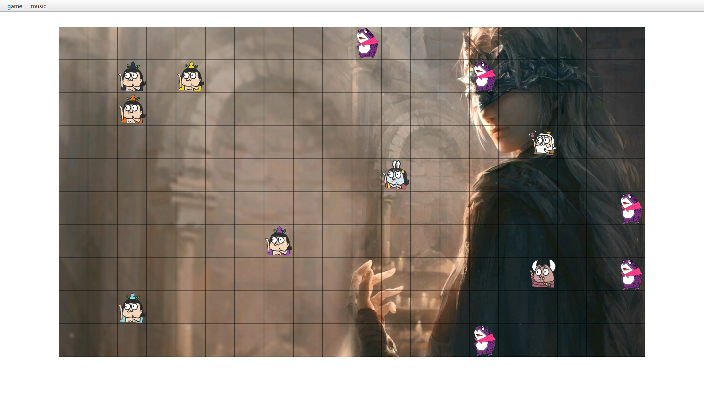
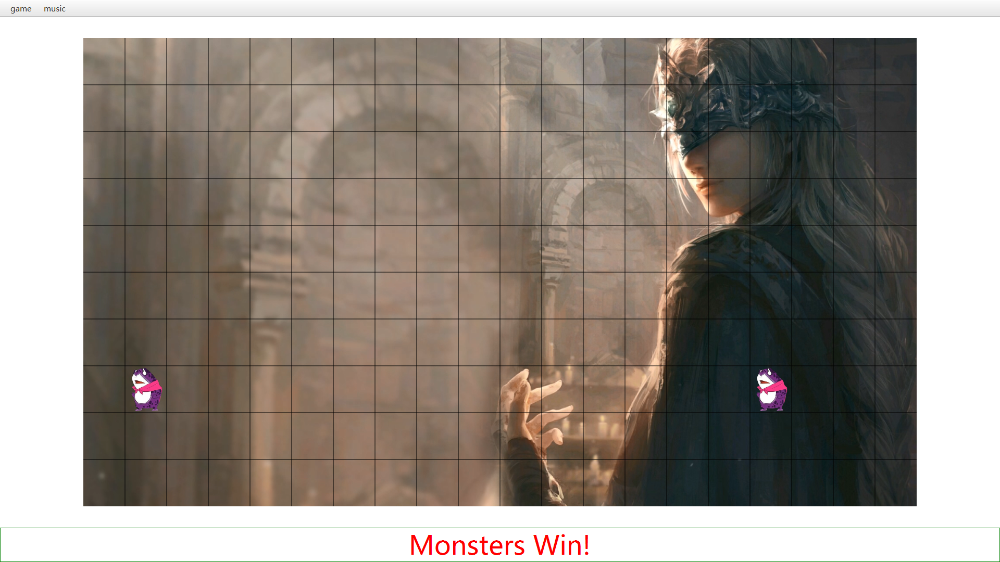

# CalabashFight

## Overview
我给我的游戏起名叫做`葫芦娃大战妖精之一人选一边谁输谁下楼取外卖`，游戏的功能有：
+ 开战
+ 存档
+ 读档
+ 切换背景音乐

## 主窗口与菜单栏概览

## 功能介绍
+ 开始游戏   
    + 玩法介绍
        1. 按照固定的阵型布置战场，游戏采取全随机策略，除了初始站位之外，士兵的走位、死亡完全随机
        2. 游戏玩法：仅需将鼠标光标在战场上滑动，战斗就可以进行，鼠标停止战斗暂停，鼠标划出战场战斗暂停
        3. 游戏在一方完全死亡后，停止，并在战场下方显示获胜方
        4. 此时，押对的人可以欢呼了，因为，押输的人马上下楼拿外卖  
    + 游戏截屏  
        初始战场
          
        战斗中  
        
        葫芦娃去拿外卖，谢谢
        
+ 存档与读档
    游戏过程中可以点击game菜单里的存档键与读档键进行存档与读档
+ 切换背景音乐
    为了在饥饿中体会到先辈们打妖精的辛苦，我为使用者准备了三首bgm
    + 葫芦娃：原唱
    + 葫芦娃：大张伟remix
    + 葫芦娃：原唱 大张伟 鬼畜手动remix（欢迎体验）

